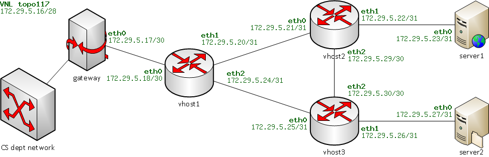
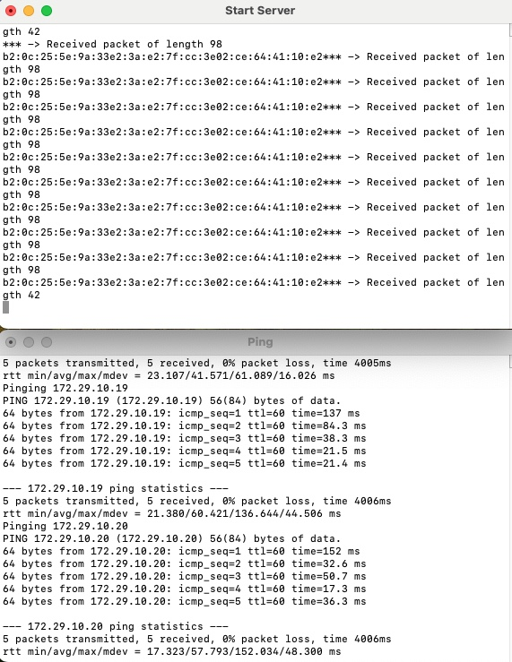
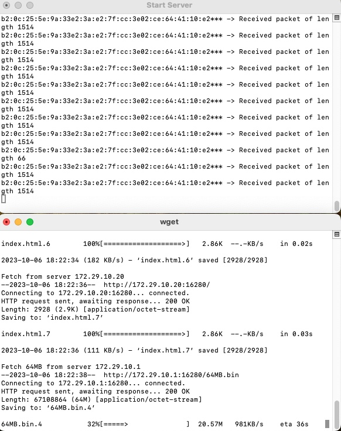
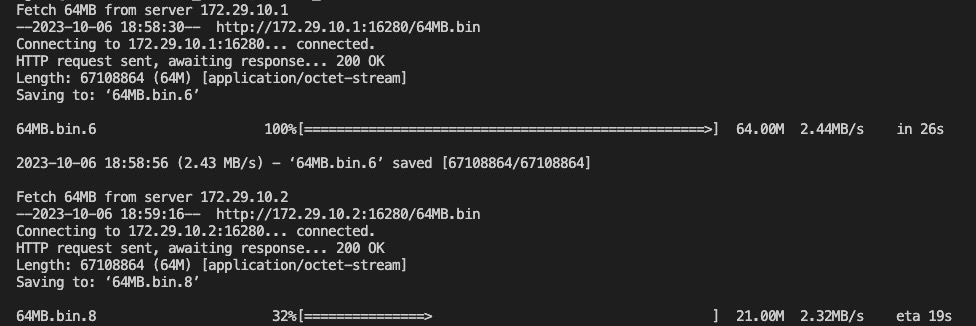

## Build Your Own Router: CSC 525 Computer Networking Project
Functional IP router that is able to route real traffic.

## Topology

## Overview
In this project, we're tasked with building our very own IP router capable of routing real-world traffic. We began with a basic router template, and our mission is to incorporate functionalities like `ARP`, `IP forwarding`, and `ICMP ping`. The router should be able to manage traffic for diverse IP applications, including web-based file transfers.

All the test cases below have been verified and are performing as expected:

1. Ping all the interfaces of the router results in 0% loss and delay < 10ms.
1. Ping all server interfaces results in 0% loss and delay < 10ms.
1. Examine the traffic log using `tcpdump` to verify correct ARP behavior, including the use of ARP
cache and the timeout of ARP cache.
1. Successful retrieval of a web page:
`wget http://server_IP:16280`
1. Successful retrieval of a large web object:
`wget http://server_IP:16280/64MB.bin`

Some screenshots:
### Ping all server interfaces results in 0% loss and delay < 10ms

### Successful retrieval of a web page and retrieval of large web object

### Successful retrieval of a large web object

## Usage:
1. After cloning, untar the topology within the repository
1. Run the script test_ping.sh to ping all the servers
1. Run the script test_download.sh to download web page and large file
Note: the server IPs need to be changed in both testing scripts for any other topology other than Topology #316

## Final Project:

### Start the routers:
1. ./sr -t 117 -v vhost1 -r rtable.net
1. ./sr -t 117 -v vhost2 -r rtable.empty
1. ./sr -t 117 -v vhost3 -r rtable.empty

### Scenario 1: Fail one link between vhost1 and vhost2:
1. ./vnltopo117.sh vhost1 setlossy eth1 100
1. ./vnltopo117.sh vhost2 setlossy eth0 100
1. Wait for 1-2 minutes
1. ./test_ping.sh
1. ./test_download.sh
1. ./vnltopo117.sh vhost1 setlossy eth1 0
1. ./vnltopo117.sh vhost2 setlossy eth0 0

### Scenario 2: Fail one link between vhost1 and vhost3:
1. ./vnltopo117.sh vhost1 setlossy eth2 100
1. ./vnltopo117.sh vhost3 setlossy eth0 100
1. Wait for 1-2 minutes
1. ./test_ping.sh
1. ./test_download.sh
1. ./vnltopo117.sh vhost1 setlossy eth2 0
1. ./vnltopo117.sh vhost3 setlossy eth0 0

### Scenario 3: Fail one link between vhost2 and vhost3:
1. ./vnltopo117.sh vhost2 setlossy eth2 100
1. ./vnltopo117.sh vhost3 setlossy eth2 100
1. Wait for 1-2 minutes
1. ./test_ping.sh
1. ./test_download.sh
1. ./vnltopo117.sh vhost2 setlossy eth2 0
1. ./vnltopo117.sh vhost3 setlossy eth2 0

### Known Issues:
1. Sometimes when we set the loss of one link to 100% of a particular vhost, then we may encounter a Segmentation Fault error in the router consoles, possibily due to memory leak. Despite many attempts and efforts, we were unable to resolve this.
As a workaround, restart the router which had the seg fault issue.

## Team Members:
1. Bhavya Sharma (bhavyasharma@arizona.edu)
1. Urvika Gola (ugola@arizona.edu)